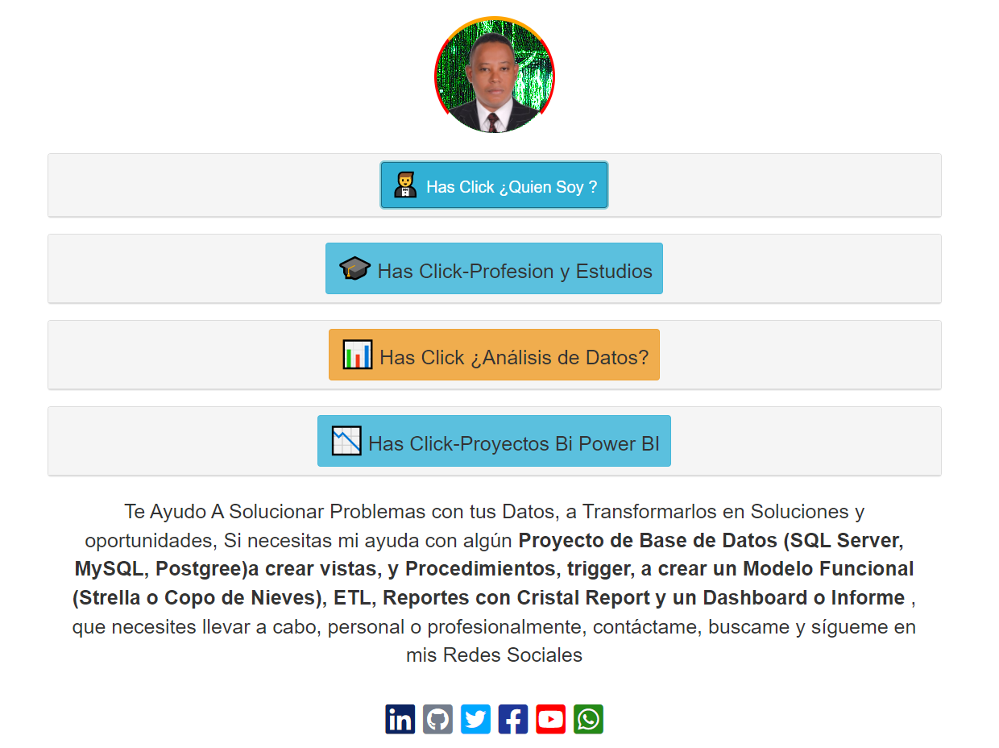

# PORTAFOLIO_WEB_JPV

PORTAFOLIO_WEB_JPV CON TECNOLOGIAS HTML, CSS, JAVASCRIP, BOOTSTRAP, ANGULAR, SQL, POWER BI.

"## 😀 Creacion de Interface y diseños UX-UI,con los Lenguaje HTML, CSS, Javascript, Bootstrap, Para Presentar Proyectos Web, y Poryectos de BI con Power BI, haciendo uso de SQL Server, 
Archios Excel, CSV, Web, uso de APIs, y diferentes analisis de datos.

## CAPTURA DE PANTALLA # 1

## CAPTURA DE PANTALLA # 2

" URL al Proyecto: https://juancitopena.github.io/PORTAFOLIO_WEB_JPV/"
